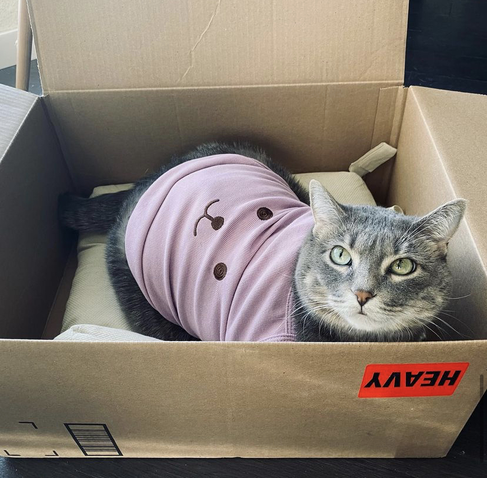

## Hello, I'm Le! 
I am currently a fourth-year Ph.D. student at University of Minnesota, Twin City
</a> 
</em></p>

[)](https://www.linkedin.com/in/le-peng-98668b204/)
[](https://sites.google.com/view/le-peng/home)


###  A little more about me...  

```python
class Me(Human):
  def __init__(self):
    self.pronouns = "He" | "Him",
    self.name = "Le Peng"
    self.code = ["Python", "C++", "Java"]
    self.research_interest = {
        "Foundational ML": ["Imbalanced Learning", "Transfer Learning"],
        "HealthCare": ["Federated Learnig", "Medical Imaging"]
    }
```


###   About my cat...
Checkout my cat, and find her on Instagram 


:stuck_out_tongue_winking_eye:  [](https://www.instagram.com/zuipang_pangzi/?hl=en)


---
<!--START_SECTION:waka-->


**🐱 My GitHub Data** 

> 🏆 88 Contributions in the Year 2022
 > 
> 📦 222.5 kB Used in GitHub's Storage 
 > 
> 🚫 Not Opted to Hire
 > 
> 📜 40 Public Repositories 
 > 
> 🔑 10 Private Repositories  
 > 
📊 **This Week I Spent My Time On** 

```text
💬 Programming Languages: 
Python                   1 hr 26 mins        ⣿⣿⣿⣿⣿⣿⣿⣿⣿⣿⣿⣿⣿⣿⣿⣿⣿⣿⣿⣿⣿⣿⣿⣀⣀   94.95% 
Text                     4 mins              ⣿⣀⣀⣀⣀⣀⣀⣀⣀⣀⣀⣀⣀⣀⣀⣀⣀⣀⣀⣀⣀⣀⣀⣀⣀   5.05%

🔥 Editors: 
VS Code                  1 hr 30 mins        ⣿⣿⣿⣿⣿⣿⣿⣿⣿⣿⣿⣿⣿⣿⣿⣿⣿⣿⣿⣿⣿⣿⣿⣿⣿   100.0%

💻 Operating System: 
Linux                    1 hr 30 mins        ⣿⣿⣿⣿⣿⣿⣿⣿⣿⣿⣿⣿⣿⣿⣿⣿⣿⣿⣿⣿⣿⣿⣿⣿⣿   100.0%

```

**I Mostly Code in Python** 

```text
Python                   19 repos            ⣿⣿⣿⣿⣿⣿⣿⣿⣿⣿⣿⣀⣀⣀⣀⣀⣀⣀⣀⣀⣀⣀⣀⣀⣀   46.34% 
Jupyter Notebook         8 repos             ⣿⣿⣿⣿⣿⣀⣀⣀⣀⣀⣀⣀⣀⣀⣀⣀⣀⣀⣀⣀⣀⣀⣀⣀⣀   19.51% 
C++                      5 repos             ⣿⣿⣿⣀⣀⣀⣀⣀⣀⣀⣀⣀⣀⣀⣀⣀⣀⣀⣀⣀⣀⣀⣀⣀⣀   12.2% 
Java                     4 repos             ⣿⣿⣀⣀⣀⣀⣀⣀⣀⣀⣀⣀⣀⣀⣀⣀⣀⣀⣀⣀⣀⣀⣀⣀⣀   9.76% 
MATLAB                   3 repos             ⣿⣀⣀⣀⣀⣀⣀⣀⣀⣀⣀⣀⣀⣀⣀⣀⣀⣀⣀⣀⣀⣀⣀⣀⣀   7.32%

```


 Last Updated on 21/10/2022 07:35:04 UTC
<!--END_SECTION:waka-->

### Github Stats


**These Readme stats are generated using github action [awesome-readme-stats](https://github.com/anmol098/waka-readme-stats)**
