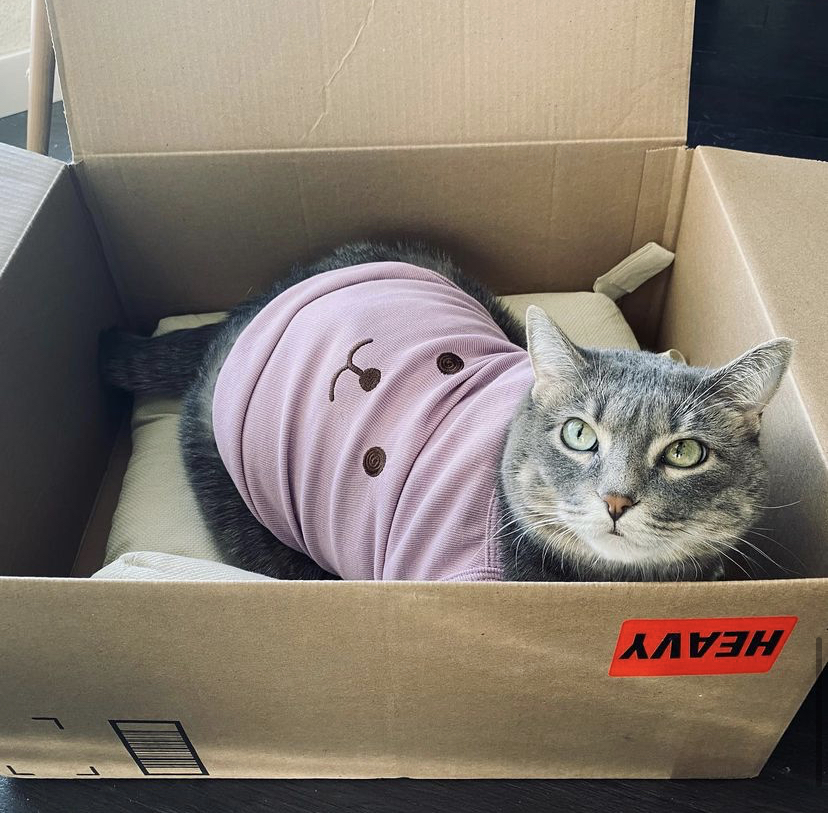

## Hello, I'm Le! 
I am a Ph.D. candidate at the University of Minnesota, Twin Cities
</a> 
</em></p>

[)](https://www.linkedin.com/in/le-peng-98668b204/)
[](https://pl97.github.io/)


###  A little more about me...  

```python
class Me(Human):
  def __init__(self):
    self.pronouns = "He" | "Him",
    self.name = "Le Peng"
    self.code = ["Python", "C++", "Java"]
    self.research_interest = {
        "Foundational ML": ["Imbalanced Learning", "Transfer Learning", "Doman Adaptation"],
        "HealthCare": ["FederatedLearning", "Medical Imaging Analysis", "Natural Language Processing"]
    }
```


### <a href="https://www.instagram.com/zuipang_pangzi/?hl=en"></a>  About my cat...
Checkout my cat, and follow her on Instagram 


:stuck_out_tongue_winking_eye:  [](https://www.instagram.com/zuipang_pangzi/?hl=en)


---
<!--START_SECTION:waka-->


**🐱 My GitHub Data** 

> 📦 463.0 kB Used in GitHub's Storage 
 > 
> 🏆 8 Contributions in the Year 2026
 > 
> 💼 Opted to Hire
 > 
> 📜 47 Public Repositories 
 > 
> 🔑 17 Private Repositories 
 > 
**I'm an Early 🐤** 

```text
🌞 Morning                235 commits         ⣿⣿⣀⣀⣀⣀⣀⣀⣀⣀⣀⣀⣀⣀⣀⣀⣀⣀⣀⣀⣀⣀⣀⣀⣀   09.86 % 
🌆 Daytime                1065 commits        ⣿⣿⣿⣿⣿⣿⣿⣿⣿⣿⣿⣀⣀⣀⣀⣀⣀⣀⣀⣀⣀⣀⣀⣀⣀   44.69 % 
🌃 Evening                666 commits         ⣿⣿⣿⣿⣿⣿⣿⣀⣀⣀⣀⣀⣀⣀⣀⣀⣀⣀⣀⣀⣀⣀⣀⣀⣀   27.95 % 
🌙 Night                  417 commits         ⣿⣿⣿⣿⣀⣀⣀⣀⣀⣀⣀⣀⣀⣀⣀⣀⣀⣀⣀⣀⣀⣀⣀⣀⣀   17.50 % 
```


📊 **This Week I Spent My Time On** 

```text
💬 Programming Languages: 
No Activity Tracked This Week

🔥 Editors: 
No Activity Tracked This Week

💻 Operating System: 
No Activity Tracked This Week
```

**I Mostly Code in Python** 

```text
Python                   40 repos            ⣿⣿⣿⣿⣿⣿⣿⣿⣿⣿⣿⣿⣿⣿⣿⣀⣀⣀⣀⣀⣀⣀⣀⣀⣀   61.54 % 
Jupyter Notebook         11 repos            ⣿⣿⣿⣿⣀⣀⣀⣀⣀⣀⣀⣀⣀⣀⣀⣀⣀⣀⣀⣀⣀⣀⣀⣀⣀   16.92 % 
C++                      5 repos             ⣿⣿⣀⣀⣀⣀⣀⣀⣀⣀⣀⣀⣀⣀⣀⣀⣀⣀⣀⣀⣀⣀⣀⣀⣀   07.69 % 
MATLAB                   3 repos             ⣿⣀⣀⣀⣀⣀⣀⣀⣀⣀⣀⣀⣀⣀⣀⣀⣀⣀⣀⣀⣀⣀⣀⣀⣀   04.62 % 
HTML                     1 repo              ⣀⣀⣀⣀⣀⣀⣀⣀⣀⣀⣀⣀⣀⣀⣀⣀⣀⣀⣀⣀⣀⣀⣀⣀⣀   01.54 % 
```


 Last Updated on 04/05/2026 20:01:44 UTC
<!--END_SECTION:waka-->

### Github Stats


**These Readme stats are generated using github action [awesome-readme-stats](https://github.com/anmol098/waka-readme-stats)**
